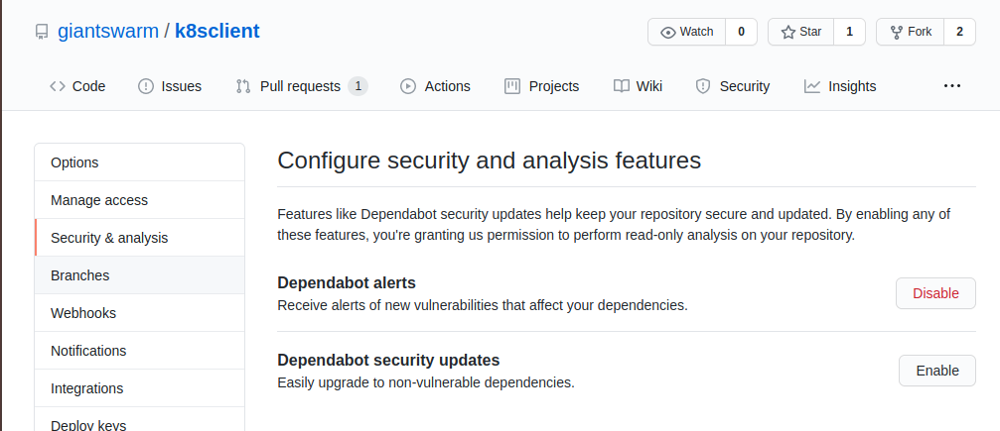

# Dependabot

Dependabot is a service integrated into GitHub which watches the listed dependencies in
our repos and automatically opens PRs to update them when updates are available.

It will open a Pull Request and provide a Changelog and compatibility score for the update.
You can specify default reviewers for a given repository, apply labels automatically,
and Dependabot will rebase, update, or close the PR as necessary if the project's requirements
or the upstream updates change.

This should be enabled for every project by default and configured as necessary to reduce noise.

## Why

Some dependencies we manage ourselves, but not the vast majority.
Having automated PRs is helpful because it saves us the trouble of manually tracking updates
or maintaining a homegrown tool to do so.

However, this is more than a convenience feature.
Dependencies are a major way vulnerabilities are introduced in code, so staying up to date
is an important part of securing our platform.

For instance, [here are some vulnerabilities found in the k8s.io libraries we use](https://snyk.io/vuln/search?type=golang&q=k8s.io)

## Configuration

Dependabot updates can be enabled for a repository in the "Settings & analysis" tab of the GitHub settings UI.
To enable updates, simply click the "Enable" button as shown in the image below.


To further configure how Dependabot performs updates in your repository, use a configuration file.

A sample configuration file is included below, which excludes all `k8s.io` dependencies above `0.17.0` and includes `team-ludacris` as a reviewer on each PR:

```yml
# .github/dependabot.yml
version: 2
updates:
- package-ecosystem: gomod
  directory: "/"
  schedule:
    interval: daily
    time: "04:00"
  open-pull-requests-limit: 10
  target-branch: master
  reviewers:
    - "giantswarm/team-ludacris"
  ignore:
  - dependency-name: k8s.io/**
    versions:
    - ">=0.17.0"
```

Additional configuration file options are outlined in the [Dependabot docs](https://docs.github.com/en/github/administering-a-repository/keeping-your-dependencies-updated-automatically).

When possible, exclude only known-breaking version changes (e.g. `k8s.io` dependencies are often tied to the kubernetes version running in our clusters).
This way, we continue to get updates which are compatible, but with less noise.

## Dependabot Preview

Note: some projects are still using an older version of Dependabot from before its acquisition by GitHub.
PRs from this version will be from the `dependabot-preview` bot account.

These projects should be upgraded to the new GitHub-native Dependabot, but if you need to work with the old version, here are some resources:

- [Dependabot dashboard](https://app.dependabot.com/accounts/giantswarm/) (deprecated)
- [config reference](https://dependabot.com/docs/config-file/) (syntax is deprecated)

### Upgrading

To upgrade to the GitHub "native" Dependabot:

- Click the enable button in your repo settings (see photo above)
- Dependabot will eventually open a PR translating your config file to the new syntax. If you're in a hurry, go to the old Dependabot dashboard and click "Update config file" on your repo.
- Merge the PR
- You can now manage your Dependabot settings as described above
