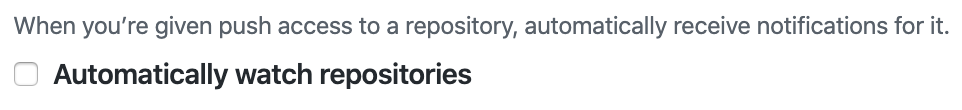
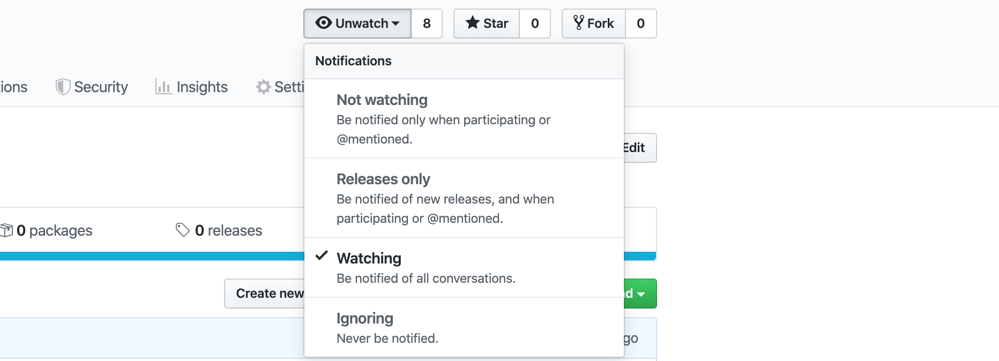

# Requesting review

This document tries to explain who should be requested for review when crafting a PR.

## Default

By default a review **should** be requested from:

- A team. Usually your team or the [team owning the component][ownership].
- Individual stakeholders or person who can bring valuable input.

By default a review **should not** be requested from:

- Chapter or SIG.

**NOTE:** Consider pinging individuals outside the team in comments instead of
requesting review on the whole change. Maybe their input is needed only for
a part of the change and there is no reason to involve them in the whole PR.

## Exceptions

For information spreading:

- Request review from relevant Chapters for documentation. E.g. Chapter PE for
  documentation for creating releases.
- Request review from relevant Chapters for `fmt`. E.g. Chapter FE for
  JavaScript related guidelines.
- PRs in projects `happa` and `giantswarm-js-client` should always be reviewed
  by Chapter FE.

For generic changes such as structure, cross-area changes, changes that are
meant to be applied across whole codebase (as opposed to a single repository)
consider requesting a review from:

- Chapter or SIG.
- WG (working group).

**NOTE:** Consider pinging Chapter/SIG/WG in comments instead of requesting
review on the whole change. Maybe their input is needed only for a part of the
change and there is no reason to involve them in the whole PR.

## Watching repositories

If for any reason you would like to be notified about changes incoming to
a particular repository use GitHub watching feature is a recommended. Note that
this is only a suggestion. Feel free to skip this section.

Suggested way of using the feature.

1. Under https://github.com/settings/notifications there is "Automatically
   watch repositories" tick-box. Make sure to untick it.
  
2. Stop watching repositories you are not interested in. The list can be found
   here https://github.com/watching. You may want to skip this step and stop
   watching them as you receive notifications.
3. Find repositories you are interested in and start watching them.
   

[ownership]: https://github.com/giantswarm/giantswarm/blob/master/teams/team-ownership.md
