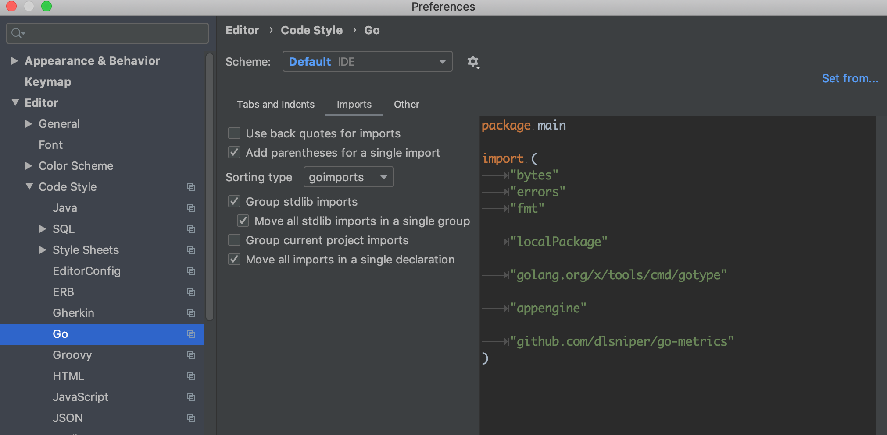

# Imports

The import block should be split into 3 separate blocks in this order.

- Native packages.
- Packages not in the current project.
- Packages in the current project.

```go

import (
	"context"

	jsonpatch "github.com/evanphx/json-patch"
	"github.com/giantswarm/microerror"

	"github.com/giantswarm/cluster-service/service/cluster/storage"
)
```

**Pros:**

- consistency
- imports are easier to read

**Cons:**

## Configuring IntelliJ Idea

