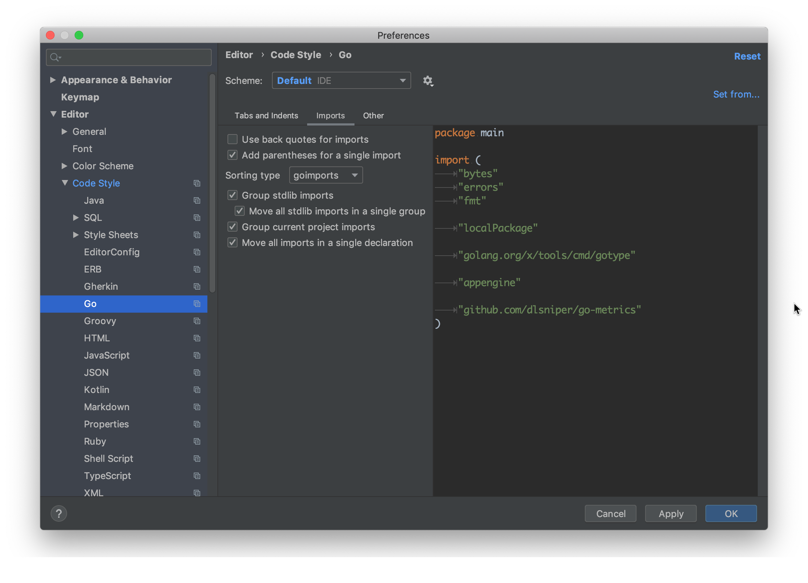
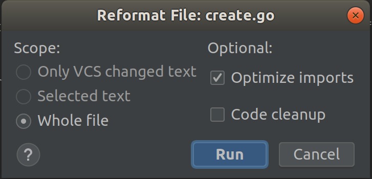

## Configuring IntelliJ Idea
### Imports
Use goimports and format the imports on your code automatically using the "optimize imports" action.
You can configure how the imports are arranged.

### Formatting
Use gofmt and format the code automatically using the "reformat code" action.

You can configure the "reformat code" action to optimize your imports as well. Use the "show reformat file dialog" action.

