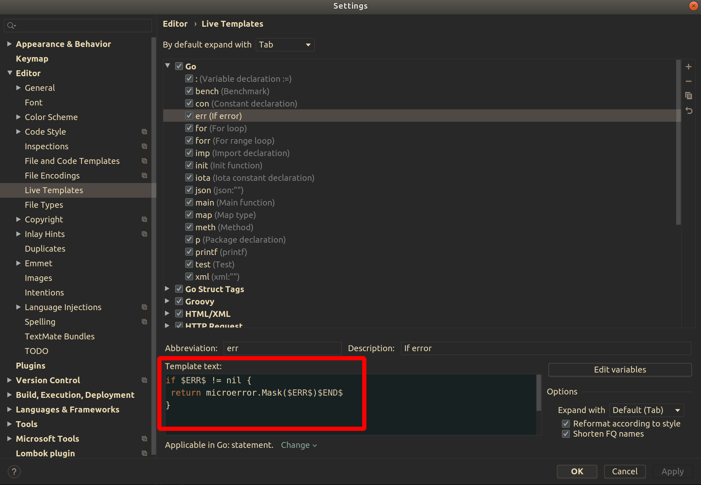

# IntelliJ/Goland configuration

We follow [a specific code format and style](https://github.com/giantswarm/fmt/blob/master/go/general_style_guide.md) for all our projects. You can configure Intellij to help you follow this style.

- [Imports](#imports)
- [Formatting](#formatting)
- [golangci-lint](#golangci-lint)
- [Autocomplete with our microerror library](#autocomplete-with-our-microerror-library)

## Imports

Use goimports and format the imports on your code automatically using the "optimize imports" action.
You can configure how the imports are arranged.


## Formatting

Use gofmt and format the code automatically using the "reformat code" action.

You can configure the "reformat code" action to optimize your imports as well. Use the "show reformat file dialog" action.


## golangci-lint

We use [golangci-lint](https://github.com/golangci/golangci-lint) as our linting tool.
This tool is executed during our CI jobs, but you can make Intellij to warn you about linting errors directly on the editor.
You need to install the Go Linter plugin


This plugin can be configured to select which linters to run


Now, make sure that lint inspections are enabled


It should show inspection warnings when linting fails.

## Autocomplete with our microerror library

You can make IntelliJ to autocomplete with [our microerror library](https://github.com/giantswarm/microerror/) when returning an error.
Instead of manually writing this

```go
if err != nil {
	return microerror.Mask(err)
}
```

You can use a _LiveTemplate_ so that the IDE automatically writes that when you type `err`.


